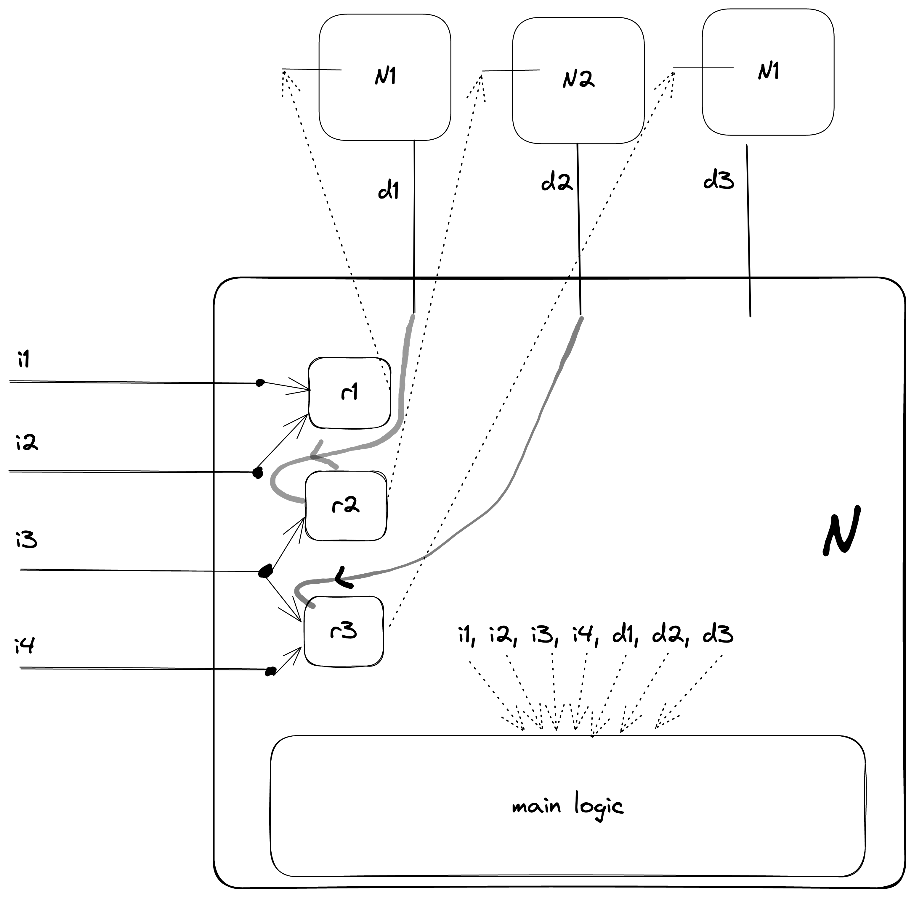

# Krystex

Krystex (**Kryst**al **Ex**ecutor) is a generic execution engine for synchronous workflows.

## Introduction

Krystex is designed to execute arbitrary synchronous business workflows which can involve making API
network calls to other microservices.

These synchronous workflows could be the business logic inside services which perform
high-throughput, low-latency "scatter-gather" operations from across multiple
other microservices, while performing complex transformations and aggregations of data, before
finally returning the aggregated data as response to their clients.

Synchronous workflows could also be the synchronous parts of large asynchronous workflows which are
made from multiple synchronous "sub-workflows" tied together via asynchronous channels like
persistent queues, timers, end-user responses, etc.

## Design goals

### What krystex is

Krystex is an execution engine which focuses on the non-functional / runtime aspects of the
application. Its concerns include:

* Concurrency
* Low-latency
* High-throughput
* Caching
* Dynamic configurability
* Optimal resource reclamation and garbage collection

### What krystex is NOT

Krystex is not designed to solve for functional and development-time use cases. For example, krystex
**DOES NOT** understand or have support for the following:

* **Mandatory vs. optionality** - For krystex, everything is optional
* **Type-safety** - For krystex, everything is either a plain old java `Object`, a `Throwable` or
  a `HashMap<>` (more on this later)
* **Batching** - For krystex, every unit of computation takes `1` set of inputs and returns
  exactly `1` outputs.
  (This is a bit debatable. One could argue that batching is a non-functional
  aspect of a workflow. In the future, krystex might provide first-class support for batching. But
  for now, batching is expected to be solved by clients of Krystex
  via [LogicDecorators](#logic-decorator).)

Because of this design choice, Krystex is not very developer-friendly, and is not supposed to be
used by application developers directly. It is expected that other
frameworks (like [vajramDef](../vajramDef/README.md)) will create
abstractions over krystex which provide a developer-friendly environment to write application logic,
and then translate/compile these abstractions into Krystal native entities for runtime execution.

## Concepts

### KrystalExecutor

The [KrystalExecutor interface](src/main/java/com/flipkart/krystal/krystex/KrystalExecutor.java) is
the only entry point for all Krystex execution requests. The default and, currently, the only
implementation of KrystalExecutor is
the [KryonExecutor](src/main/java/com/flipkart/krystal/krystex/kryon/KryonExecutor.java).
The remaining part of this document focuses on the KryonExecutor and its internals.

### Kryon

A kryon is the atomic unit of work in a krystex. It
has [inputs](#kryon-input), [dependencies](#kryon-dependency), [resolvers](#dependency-input-resolver-logic)

### KryonDefinition

A kryon definition represents the definition of one unit of work in krystex and holds the following
information

* a vajramID - a unique identifier for every kryon. In a given KryonExecutor, there can only be
  on instance of a kryon having a given vajramID.
* a reference to a stateless logic/function (the unit of work) - called
  the [main logic](#kryon-output-logic) of the kryon
* references to other kryon definitions which are [dependencies](#kryon-dependency) of this kryon
  definition
* references to [resolver functions](#dependency-input-resolver-logic)

As you can see, none of the above information is request-specific, since there are no references to
inputs and outputs. For this reason, kryon definitions are created once and cached for the lifecycle
of the application. And are used as templates for [Kryons](#kryon) which are created afresh for every
new instance of the KryonExecutor.

### Kryon Output Logic

Every kryon has exactly one function which has the responsibility of computing the output of the
kryon. This called the output logic. If the output logic fails with an Exception, then the kryon is
considered to have failed with the same exception.

### Kryon Input

(or just **input**)

* A kryon can optionally declare inputs.
* Every input has a name which must not clash with the name of any other input
  or [dependency](#kryon-dependency) of this kryon.
* A kryon can complete execution only after values for all its
  inputs are made available to it. Clients of the kryon (either via KryonExecutor or other
  kryons
  which [depend](#kryon-dependency) on this kryon) are expected to provide one value each for EVERY
  input of the kryon - only then the kryon is executed. The provided values could potentially be null
* A kryon can be executed multiple times with different sets of inputs.
* All the inputs need not be provided to a kryon together. Different input values can be provided to
  the kryon at different points in time. The kryon will greedily perform any intermediate operations (
  See [resolvers](#dependency-input-resolver-logic)) that it can with the provided inputs. The kryon
  will
  complete execution only once values for all the inputs are provided. Till then the kryon will
  remain in an intermediate (semi-executed) state.

### Kryon Dependency

(or just **dependency**)

* Kryons can optionally declare dependencies, which are kryons on which this kryon depends.
* Every dependency has a name which must not conflict with the name of any
  other [input](#kryon-input) or dependency of this kryon.
* A kryon can complete execution only after all of its dependencies have completed execution (either
  successfully, with an error, or explicitly skipped.)

### Dependency-Input resolver logic

(or just **resolver**)

* A resolver in a kryon is a function that is responsible for computing (resolving) the inputs of a
  dependency of the kryon.
* One resolver can resolve the inputs of exactly one dependency.
* One resolver can resolve one or more inputs of a dependency - this might be all the inputs of a
  dependency or a subset of those inputs. In case a resolver resolves only a subset of a
  dependency's inputs, more than one resolver is needed to completely
  resolve that dependency.
* A kryon which has `N` dependencies each with at least one input, must have at least `N` resolvers -
  one for each dependency of the kryon.
* Every input of every dependency must be resolved by exactly one resolver. In other words, all the
  resolvers of a kryon must together resolve ALL the inputs of all the dependencies of the
  kryon. Any input of any dependency must not be left unresolved - Krystex will wait indefinitely if
  this happens. It is the responsibility of the clients of krystex to perform necessary checks at
  development/build time to prevent this scenario from happening.

### Logic Decorator

Logic decorators are a simple yet powerful way to extend Krystex. Krystex allows clients to define
and plug-in decorators which wrap the output logic of kryons. In this wrapped logic, clients are free
to add functionality to the framework. The decisions like which logic decorators should decorate
which kryons, in which order and how a logic decorator instance is shared across hoe many kryons, etc.
are completely left to clients, making this a very powerful feature.

Example use-cases include:

1. Implementing rate-limiters
2. Adding logging
3. Implementing metric collectors
4. Wrapping blocking operations inside a thread-pool etc.

* Logic decorators can be uniquer per kryon, or can be shared across kryons.
* Logic decorators can be request-scoped or session-scoped (last for the application lifetime.)
* Logic decorators, unlike kryon logics (like resolvers and output logics) can be stateful.

<!--TODO-->

## How KryonExecutor Works

### Command Queue - (SingleThreadExecutor)

The KryonExecutor executes all the required kryons in a single thread using the event loop
pattern. This means that none of the resolver logics or output logics of any kryon are allowed to block
for
any amount of time. They are expected to return instantly after wrapping any long-running operation
in a `CompletableFuture`. All long-running operations like I/O should either be performed using
models like non-blocking async IO, or should be wrapped in their own threadPoolExecutors, which
instantly return a `CompletableFuture` after submitting the long-running operation to the
threadPool.
<!-- TODO add link to workflow diagram -->

### Common data structures

All data transfers in the Krystal Programming model are performed via a few standard Type-agnostic
data structures which act as the common low-level interaction mechanism across programming models (
like vajrams) and execution engines (like krystex). Because of this standardization, objects created
by programming models can be directly used by the execution engine.
The data structures are as follows:

1. [`CompletableFuture`](https://docs.oracle.com/en/java/javase/17/docs/api/java.base/java/util/concurrent/CompletableFuture.html) -
   standard java data structures to represent a value or error which is being computed but not yet
   ready
2. [`Errable`](../krystal-common/src/main/java/com/flipkart/krystal/data/Errable.java) - a
   wrapper data structure encapsulating either a value or an error. This can be thought of as a
   completed version of a `CompletedFuture`. All empty values are supposed to be represented
   by `Errable#emtpty()`. krystex assumes `null`s are never returned.
3. [`Facets`](../krystal-common/src/main/java/com/flipkart/krystal/data/Inputs.java) - A container
   object which can holds input and dependency values of a kryon.
4. [`Results`](../krystal-common/src/main/java/com/flipkart/krystal/data/Results.java) - A container
   object which holds the depResponses of executing a given dependency of a kryon multiple times in a
   '[fanout](#dependency-fanouts)' pattern.

### Example execution

Following is a logic view of a representative krystex kryon `N`:

* Kryon `N` has four inputs `i1`, `i2`, `i3` and `i4`.
* It also has three dependencies `d1`,`d2`, and `d3`.
* Dependency `d1` is on kryon `N1`, `d2` is on kryon `N2` and `d3` is again on `N1`. This means that
  this kryon can call kryon `N1` twice.
* Both `N1` and `N2` have one input each.
* `N` has three resolvers:
    * `r1` resolves the input of `d1` using inputs `i1` and `i2`.
    * `r2` resolves the input of `d2` using inputs `i3` and the result of dependency `d1`.
    * `r3` resolves the input of `d3` using inputs `i3` and `i4` and the result of dependency `d2`.
* The output logic has access to all the four input values and three dependency depResponses.

For the purpose of this example, let us assume `N1`, and `N2` themselves have no other dependencies.
When we trigger the kryon `N` with a set of inputs (all inputs need not be provided at the same
time). This is how the execution proceeds:

1. Wait for `i1` and `i2` to be provided.
2. Execute `r1` (Do not wait for `i3` and `i4`). `r1` finishes immediately since resolvers are not
   allowed to make blocking calls.
3. Take the output of `r1` and provide it to kryon `N1`
4. `N1` has no resolvers/dependencies. Execute output logic of `N1`
5. Wait for output logic of `N1` to finish.
6. Wait for `i3` to be provided.
7. Execute `r2` with `i3` and depResponses of `d1` (`N1`). `r2` finishes immediately.
8. Take the output of `r2` and provide it to kryon `N2`
9. `N2` has no resolvers/dependencies. Execute output logic on `N1`. Wait for this to complete.
10. Wait for `i4` to be provided.
11. Execute `r3` with `i3`, `i4` and the depResponses of `d2`(`N2`). `r3` finishes immediately.
12. Take output of `r3` and provide it to kryon `N1`.
13. `N1` has no resolvers/dependencies. Execute output logic of `N1` with the provided input. Wait for
    this to complete.
14. Execute the output logic of `N`

Here is the shorter-form of the execution sequence:

`r1` -> `N1` -> `r2` -> `N2` -> `r3` -> `N1` -> `N`

The result of executing the output logic of `N` is considered the final result of the computation.

<!-- TODO add execution animation -->

## Capabilities

### Dependency fanouts

### Recursive dependencies

