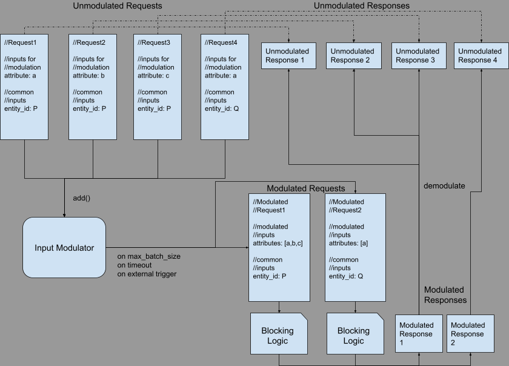

The Vajram Programming Model
============================

## Introduction

The Vajram Programming model is a way to design and write synchronous scatter-gather-like business
workflows. Apart from the general goals of the Krystal Project, the vajram programming model is
designed keeping in mind the following goals:

1. Easy self-serve development: The Vajram programming model is designed to allow for multiple
   developers from different disconnected teams to code, test and deploy business logic for which
   they are the domain expert in their own CVS repo but deployed into a common runtime environment
   at the same time minimizing chances of introducing regressions in functionality and performance
   of the applications in which the code is being deployed.
2. Cross-feature and Cross-application re-usability: The same piece of business logic can be reused
   for different
   requirements within an application and also across different application runtimes.
3. Minimize the amount of code handwritten by developers: The vajram ecosystem provides extensive
   code generation tools to generative most of the mundane spaghetti logic which a developer needs
   to write to conform the to the platform interfaces.
4. Focus on business logic: Every line of code written by a developer should strictly only have the
   intent of expressing some functional domain logic. For example, application developers should not
   write any logic just intended to massage data structures to conform to the platform
   requirements. Instead, the platform should have the intelligence to understand the intent of the
   business logic written by the developer, and mould around that intent seamlessly

## Programming Model Design

### Vajram

The basic building block of a Krystal is a Vajram. A vajram is a function-like unit of work (
actually a set of functions) that act as a unit of
[structured concurrency](https://vorpus.org/blog/notes-on-structured-concurrency-or-go-statement-considered-harmful/)
that allows developers to declare their functional requirement in a way that enables the Krystal
platform to execute the complete request in the most optimal fashion.

Each vajram is responsible for one well-defined, reusable business logic (possibly
encapsulating a network call to an API). Each Vajram is identified by its identifier (
VajramID). This identifier is globally unique and can be used as-is by adding it as a dependency of
another Vajram.

Every Vajram is defined by the following properties

* **Inputs**Each input has the following properties
    * **Input Data Type**: Each input has a well-defined datatype. These data types can be one of
      the
      standard data types supported by the platform like string, integer, set etc. or can be a
      custom java object.
    * **Optionality**: Inputs can either be mandatory or optional (optional is the default). If a
      null value is passed to a mandatory input of a vajram, the vajram is never executed, and an
      exception is thrown instead.
    * **Needs Batching**: Indicates to the platform that the input needs to be batched before executing this vajram
    * **Docmentation**: Describes this input
* **Dependencies**:
    * **Dependency Name**: Every dependency has a name unique within that vajram.
    * **Dependency Vajram**: The vajram whose output is needed to execute this vajram.
    * **Optionality**: Dependencies can either be mandatory or optional (optional is the default).
      If a mandatory dependency fails, then this vajram automatically fails with the same exception.
* **Output Type**: This is the datatype of the output of a Vajram. Each vajram has a single
  output type.
* **Dependency Resolvers**: The responsibility of providing values for the inputs of the
  dependencies of a vajram lies with that vajram itself. This is done by functions called dependency
  resolvers. For example, Let us say a Vajram V1 has two inputs `i1` and `i2`, and two
  dependencies `D1` and `D2`.And let us say `D1` has one input `a`, and D2 has two inputs `b`
  and `c`. Dependency resolvers in Vajram `V1` are pieces of business logic which take as input some
  subset of the inputs and dependencies of `V1` and output values which are then bound to the inputs
  of a dependency of `V1`. This means that every dependency of a vajram which has at least one input
  needs a corresponding resolver defined by `V1`. The dependency `D2` of `V1` has 2 inputs, so the
  resolver defined by `V1` for `D2` outputs a tuple, with value in the tuple corresponding to each
  of the inputs of `D1`.

```
// Pseudo-code
vajram D1(inputs: a)
vajram D2(inputs: b,c)

vajram V1(inputs: i1, i2)(dependencies: D1, D2)
    resolve D1(a) using i1,i2 -> return i1 + i2;
    resolve D2(b,c) using i1, D1 -> return i1 + D1;
```

* SDLC Metadata:
    * Owner Team:
    * POC Email:
    * Oncall alias:
* Documentation: Describing in detail what this Vajram does, and how to use it - and how not to.
* Permissions: RESTRICTED/PRIVATE - Vajram owners can decide who can declare a dependency on the
  Vajram.

### Programming Spec

```java
import com.flipkart.userservice.UserServiceVajram;
import com.flipkart.krystal.vajram.Input;

/**
 * Given a userId, this Vajram composes and returns a 'Hello!' greeting addressing the user by 
 * name (as declared by the user in their profile).
 */
@VajramDef("com.flipkart.greetingVajram") //Unique Id of this Vajram
//SyncVajram means that this Vajram does not directly perform any blocking operations.
public abstract class GreetingVajram extends ComputeVajram<String> {

  // Static declaration of all the facets (inputs and dependencies) of this Vajram.
  // This includes inputs provided by clients of this vajram, 
  // dependencies of this vajram, as well as
  // objects like loggers and metrics collectors injected by the runtime.

  @Input //This is an input and needs to be provided by clients of this vajram.
  String userId; //Name of this input is userId and this input is mandatory. 

  @Dependency(UserServiceVajram.ID) //This vajram has a dependency on UserServiceVajram
  UserInfo userInfo; //UserServiceVajram returns object of type UserInfo and this is a mandatory dependency

  @Inject //This is an injected input (provided by the runtime instead of the client vajram)
  Logger log; //'log' is the name of this mandatory input

  @Inject //This is an injected input
  @Named("dataPlatformEventSink") //This name is used for the input injection.
  Optional<AnalyticsEventSink> eventSink; // 'eventSink' is the name of this optional input whose datatype is AnalyticsEventSink

  // Resolving (or providing) unresolved inputs of resolved dependencies
  // is the responsibility of 
  // this Vajram (unresolved inputs are resolved by client Vajrams).
  // In this case the UserServiceVajram needs a user Id to retrieve user info from User Service.
  // So it's GreetingVajram's responsibility to provide that input.
  @Resolve(dep = userInfo_n, inputs = UserServiceRequest.userId_n)
  static String userIdForUserService(@Using(userId_n) String userId) {
    return userId;
  }

  // This is the core business logic of this Vajram
  // Compute vajrams can return any object. 
  // IOVajrams need to return {CompletableFuture}s
  @Output
  public static String sayHello(
      /* The static final constant Strings 'userId_n', 'userInfo_n', 'log_n', 'eventSink_n'
         are autogenerated by the framework to ease their use in @Using and @Resolve annotations*/
      @Using(userId_n) String userId,
      @Using(userInfo_n) UserInfo userInfo,
      @Using(log_n) Logger log,
      @Using(eventSink_n) Optional<AnalyticsEventSink> eventSink) {
    String greeting = "Hello " + userInfo.name() + "! Hope you are doing well!";
    {
      log.info("Greeting user " + userId);
      eventSink.ifPresent(aes -> aes.pushEvent("event_type", new GreetingEvent(userId, greeting)));
    }
    return greeting;
  }
}
```

## Design choices in Detail

### Static dependency declaration

One of the core tenets of Krystal is to allow for a reactive execution environment to minimize usage
of resources like
threads. The vajram (and [krystex kryon](../krystex/README.md#kryon)) abstractions are designed to
allow for this optimization. By requiring inputs and dependencies to be declared statically, the
Krystal framework is able to load the complete call graph as a directed acyclic graph (DAG) *
*without** having to execute any part of the code. This has multiple advantages:

* **Catch non-functional regressions at build time**: Developers and code reviewers can reason
  through the call graph characteristics of the application. IF a new dependency is introduced,
  tooling can load the before and after states of the callgraph and summarize the changes in the
  call graph and warn of potential changes in the performance characteristics of the applicaiton.
  For example, let's say a resolver which consumes only the inputs of a vajram is changed to consume
  a depenency value. This
  in effect converts a parallel dependency to a sequential dependency - this can increase the
  latency of an application. Static declarations make catching such changes very easy.
* **Call graph optimization**: Because of these static declarations, the Krystal
  runtime ([Krystex](../krystex)) is a bird's eye view of the state of a request execution and is
  able to optimally achieve maximal concurrency as well as batching of IO calls. Doing this is
  almost impossible without static input and dependency definitions.
* Allow for extensive [code generation](#code-generation)

### Code Generation

The vajram library heavily used code generation as a mechanism to strike a balance between
conflicing goals:

* Provide developers a type safe mechanism to accss and manipulate domain specific data. Domain
  specific data are objects like `User`, `Order` etc, which are functional entities and are
  invisible to the Krystal platform.
* Avoid the need for developers to write boilerplate code which transform generic framework
  entites (like `Request`, `Response`, `Map`) and domain specific entities (like `User`, `Order`
  etc.)
* Avoid the need for the framework to use reflection to access domain entities and execute domain
  logic allowing us to achieve maximum performance.

The only way to fulfill all the above goals (short of creating a new programming language), is to
use code generation in the language of choice (java). This allows developers to code a concise,
type-safe manner where the code focuses on just expressing the functional requirement.

The code generation corresponding to vajram happens during the build phase and is divided into two
phases:

* Model generation
* Impl generation

#### Model Generation

Before the vajram code is compiled, the vajram framework (today via build plugins, in future via
annotation
processing) reads the input and dependency definitions and generates the following models:

* `public` VajramRequest class encapsulates all the inputs which have `CLIENT` as one of their
  input sources. This object is generated so that resolvers of client vajrams can create requests to
  this vajram in a type safe unambiguous manner. If any inputs are optional, then their getters
  return `java.lang.Optional`. This is the only public model class generated in this
  phase. This class also contains a method to convert this functional entity into a framework
  entity - this method is used by the framework.
* `package-private` InputUtil class which contains
    * If none of the inputs are batched
        * `package-private` AllInputs class which encapsulates the values of all the `CLIENT`
          provided
          inputs, `APPLICATION` provided inputs, and dependency outputs in a type safe manner. This
          object is for use by the `@Output` function.
    * If at least one of the inputs is batched, the following classes are generated and are useful
      for batching by the [`InputBatcher`](#inputbatcher) interface.
        * `package-private` BatchableInputs class which encapsulates the values of
          those `CLIENT` provided inputs which have been marked as needing batching.
        * `package-private` CommonInputs class which encapsulates the values of those inputs which
          do not need batching as well as dependency values

#### Impl generation

After the compilation of the (abstract) vajram class written by the developer, a `final` `Impl`
class is generated, which implements the abstract class. The Krystal framework calls methods in this
class to execute the vajram. This class has all the boilerplate code which converts the framework
objects into domain objects (without having to use reflection). All the resolvers and the vajram
logic method are invoked from this Impl class. Because the impl class is generated post compilation
by reflectively analysing the vajram class, a lot developer friendly faetures are implemented in the
code generator to allow the developer to write their business logic in varying scenarious without
having to confirm to any single spec. For example, let us say there is a vajram `V1` which has a
resolver that is resolving a `string` input of a dependency :

* The resolver can return a `String` indicating that value to be bound to that input
* The resolver can return a `List<String>` or a `Set<String>` or any other `Iterable` of `String` to
  indicate to the platform this dependency needs to be called as many times as there are strings in
  the returned collection (this is called a dependency fanout).
* The resolver can return a `DependencyCommand` object indicating to the framework that there are
  scenarios where the dependency might have to be skipped altogether and so on...

Irrespective of which of the above types are returned by the resolver function, the Impl class
understands the intent of the developer and accordingly transforms these objects into relevant
frameowrk objects. This `Impl` class is intended to be used only by the framework and not by any
other developers.

### Input Batching

#### Definition

Input batching is the process of squashing/collapsing/merging multiple independent inputs to a vajram operation so that the vajram can compute outputs to these inputs in an optimal fashion consuming minimum resources like network bandwidth, disk IO etc. Input batching is a generalization of the concept we know as Batching.

##### Batching vs Modulation

There is a feature similar to batching called modulation which involved request merging which is different from batching. Batching is a process where we take N requests objects each consisting of one input parameter and merge them into a single request object containing a list of all N parameters. On the other hand,let us say there is an API which provides three info levels within a given API - LOW, MEDIUM, HIGH. Depending on the info level passed in the API, the server returns varying amounts of data — where LOW is a subset of MEDIUM which itself is a subset of HIGH. If two clients request data from the API, one with the LOW info level and one with MEDIUM, we would ideally want to make a single call with MEDIUM as the info level. Here the modulation modulates both the requests into a single request containing the MEDIUM info level.

#### Problems

Let us understand the philosophy and design Krystal Programming model's input batching feature by
considering a
hypothetical example. Let us consider a user path system which performs scatter gather operations to
serve widgets to
the client side application. It has dependencies on multiple systems like Pricing Service, Entity
Service etc. This orchestrator serves two widgets - product details and product Card on the same
web page:

```
Entity Details

Manufacture Date: XX/YY/ZZZZ

Brand: ABC
```

```
Entity Card

Title: ABC Phone

Price: ₹12300.00
```

Note that the Title, manufacturer Date, and Brand are all served by the same API of Entity Service:

#### Batch API

```java
class EntityServiceClient {

  Map<String, String> getEntityAttributes(String productId, List<String> attributeNames) {
    return httpClient.get(EntityServiceUrl + "/" + productId + "/" + attributes.join(","))
  }
}
```

Since this Entity Service server is capable of returning multiple attributes of a given product in a
single network
call, the client library API obviously reflects that capability.

##### Problem 1 - Leaking of implementation details to clients

This API is exposed to clients of Entity Service like Entity Details widget and Entity Card widget.
This is not ideal.
Ideally the API contract that Entity Service would like to provide to its client looks like this:

#### Mono API

```java
class EntityServiceClient {

  String getEntityAttribute(String productId, String attributeName);
}
```

This interface hides the implementation detail that Entity Service API supports batching of
attributes. A developer
writing a piece of business logic which needs data from Entity Service doesn't need to unnecessarily
wrap the attribute
name in a list just to conform to the API, and then doesn't need to unwrap the response map to get
the attribute value.
This makes the code simpler and representative of the actual requirements rather than the APIs
internal details.

##### Problem 2 - Suboptimal batching

Now, to avoid problem 1, the Entity Service API library can provide both the batch API and the mono
API, and clients can
choose to use the one that suits them. This way, if there is a client who needs multiple attributes
of the same product,
they can send the list of attribute names in a list to the batch API and receive all the responses
in a single call. But
this is still not optimal. What if there are two use cases in the application, both of which need
different attributes
but for the same product? How can we make sure that both these dependencies can get the data that
they need in a Entity
Service call? Blindly calling the batched API from the two call sites leads to two network calls. To
avoid this,
application owners resort sub-optimal coding patterns where all dependencies of Entity Service are
made to coordinate by
submitting their response to a common collector and once all are done submitting their requests and
acknowledging the
same, the Entity Service batch call is made. This couples multiple different clients of Entity
Service with each other,
and any time a new piece of business logic is written that needs Entity Service data, the new
developer has to be aware
of the above coordination and has to register for the same. Any such miss can cause a significant
increase in Entity
Service calls and reduction in system performance.

#### Design

##### InputBatcher

To solve the above problems, the Krystal Programming model introduces the concept called input
batching. Every Vajram which encapsulates potentially blocking logic, and can optimize its
performance by merging/squashing multiple independent requests into a single request, can declare
its inputs as needing batching by the `InputBatcher` component.

An input batcher is a stateful object that presents these APIs:

```java
public interface InputBatcher<BatchableInputs, CommonFacets> extends ConfigListener {

  void batch();

  void onBatching(Consumer<ImmutableList<BatchedFacets<BatchableInputs, CommonFacets>>> callback);
}
```

##### add(...)

Whenever a client of Entity Service requests some data from Entity Service, the Krystal Runtime
passes on this request
object to the add method of the input batcher of Entity Service vajram which stores it in memory
and in most cases**
returns an empty list. This is repeated for every other Vajram which depends on Entity Service.
Every time a new request
is added to the input batcher, it checks if the current set of requests has reached the max batch
size (a
configuration parameter of the input batcher). If this is the case, the input batcher squashes
all the pending
requests into an optimal set of batched request objects and returns this list instead of an empty
list. This is an
indication to the Krystal Runtime to trigger the actual Entity Service call now.

Sometimes some APIs do not specify a max batch size. This means the API is designed to support at
most one call per
session irrespective of the number of requests. Also, even if a max batch size is defined, it is
possible that all the
clients of the API have not requested enough data to reach the max batch size. In these scenarios,
the add method never
returns a list of batched requests and thus we need a way to proactively trigger the API call with
the available set
of requests. This is where the modulate and register methods come in.

##### modulate(...)

Since the Krystal Programming model is based on Vajrams which statically declare their dependencies
and because the
wiring and interaction between these Vajrams is completely under the control of the Krystal Runtime
which wires these
dependencies together, the runtime has the necessary information to know when client Vajrams of
Entity Service have
completed requesting data from Entity Service. There are multiple ways the runtime can do this we
won't go into here (
See Krystex LLD for reference implementation). When the runtime realizes that the clients have
finished requesting data
from Entity Service, the runtime calls the modulate method of the input batcher which merges all
the pending requests
and returns the list of batched requests which are then used by the Runtime to make the network
call(s).

##### register(...)

Another strategy for batching is for the input batcher to have a timeout for which it will wait
for new requests.
After that timeout is breached, the input batcher modulates all the pending requests. When it does
this, it needs a
way to notify the runtime that the batching is done. So the runtime can register a listener via
the register method.
This listener is called with the batched input when the input batcher decides it is time to
modulate. This listener
can then trigger the actual netwerk call.



#### Debatching

If a client has requested data for attribute 'a', and the input batcher has batched the input
into a list of
attributes 'a', 'b' and 'c' and the Entity Service API returns the response as a Map contains the
three attribute names
as keys and attribute values as values, it doesn't make sense to return this map to all the clients
who then expected to
query the map for their data. We would want to keep the contracts clean and return only the data
requested by a
particular client. This process of taking the response of a batched API and extracting out
the necessary
information for a given unbatched request is called debatching and can be performed either by
the input batcher,
or by the Blocking Vajram itself.

#### Rationale

The above design solves multiple problems

1. Decouples clients from server's implementation details by making batching completely invisible to
   clients - If
   tomorrow a new API with the same functional semantics, but a different batching strategy is
   written, we can just
   change the input batcher for the Vajram and keep the client contracts and code untouched.
2. Decouples clients from each other - Not keeping clients of your API independent can have
   significant negative
   consequences for evolvability and maintainability of their code. If the programming model doesn't
   hide details of
   batching from clients, then the clients will have to coordinate among themselves to collate their
   requests and only
   then trigger the API. This is bad because:
    1. clients now need to be aware of the dispatching order of their dependencies which is
       completely orthogonal to
       their business requirements.
    2. This increases the mental overhead of developers who will need to know the complete call
       graph of the application
       if they need to optimally code their business logic into an application.
    3. If we want to achieve cross application reusability of code, at development time - while
       integrating with an API,
       the developer cannot know the what other clients of the API are present in the runtime
       classpath, because the
       runtime is classpath is built at a later point in time and can change from application to
       application. This makes
       it even harder to coordinate among clients and will need additional abstractions to allow for
       this kind of
       coordination.
    4. In worst case scenarios, developers are forced to change their call graph structure itself,
       just to achieve
       optimal batching.
3. The tradeoff between Functional separation and optimal performance is no longer something to
   worry about. Clients can
   remain functionally separate and still the application can achieve optimal performance.
4. Avoid unnecessary spaghetti code: Clients of API which implement batching do not need to write
   the spaghetti code of
   modulating requests and demodulating responses. All this logic is encapsulated by the dependency
   Vajram
5. The functional contract accurately represents the domain of the server giving longevity to
   contracts.

#### Comparison with other technologies

##### [graphql/dataloader](https://github.com/graphql/dataloader)

The Graphql Dataloader solves the batching problem (not the general input batching problem) for
the javascript
programming language. The trigger for modulating is one tick in the javascript runtime eventloop,
though users can
implement more sophisticated mechanisms where the wait time is longer than the eventloop tick. Since
the java runtime
doesn't have an event loop, this cannot be achieved by a simple library. It needs a programming
model which can enable
this - and the Krystal programming model does so. While the Dataloader solves for batching all
requests within a tick of
the js eventloop, anything more sophisticated will need significant development from the application
developer to
coordinate multiple callees.

The Krystal Programming model achieves the optimal batching across ticks of the eventloop because,
apart from being a
framework running on the reactive model, it is also works on the principle of statically declared,
granular dependencies
allowing it to optimally batch and modulate requests without any additional effort from the
application developer.

# Comparison with other programming models

## [CompletableFutures](https://docs.oracle.com/en/java/javase/17/docs/api/java.base/java/util/concurrent/CompletableFuture.html) and [Promises](https://developer.mozilla.org/en-US/docs/Web/JavaScript/Guide/Using_Promises)

TBD

## [Dagger Producers](https://dagger.dev/dev-guide/producers.html)

TBD
